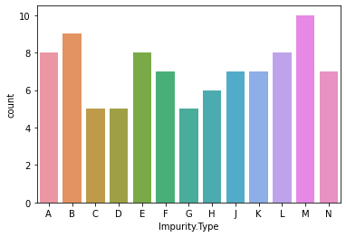
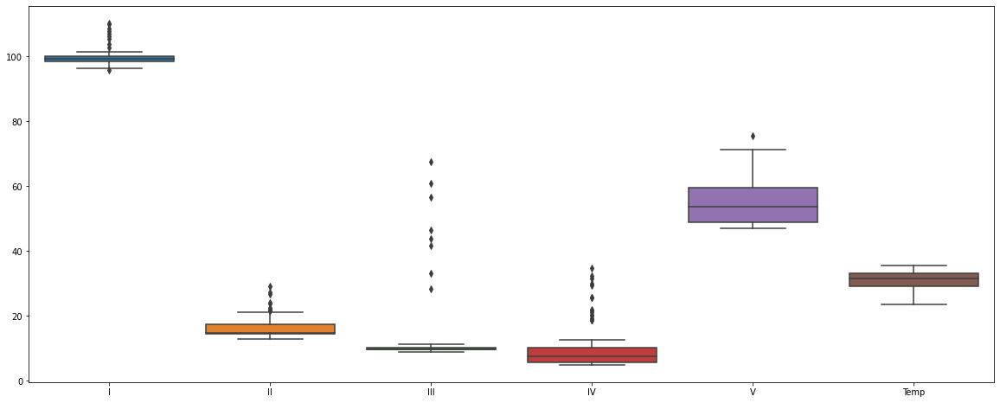
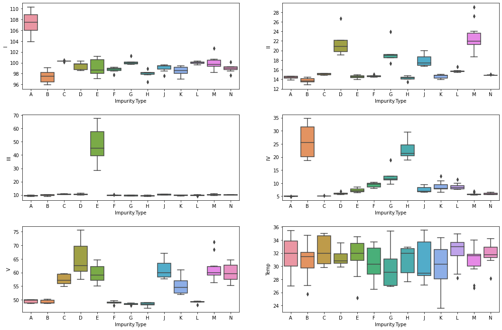
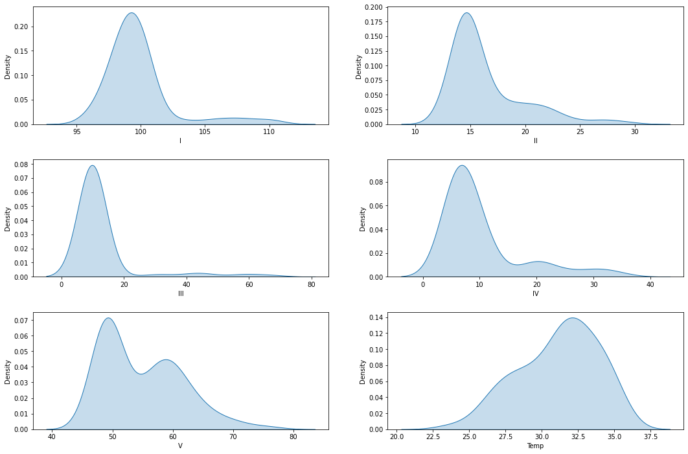
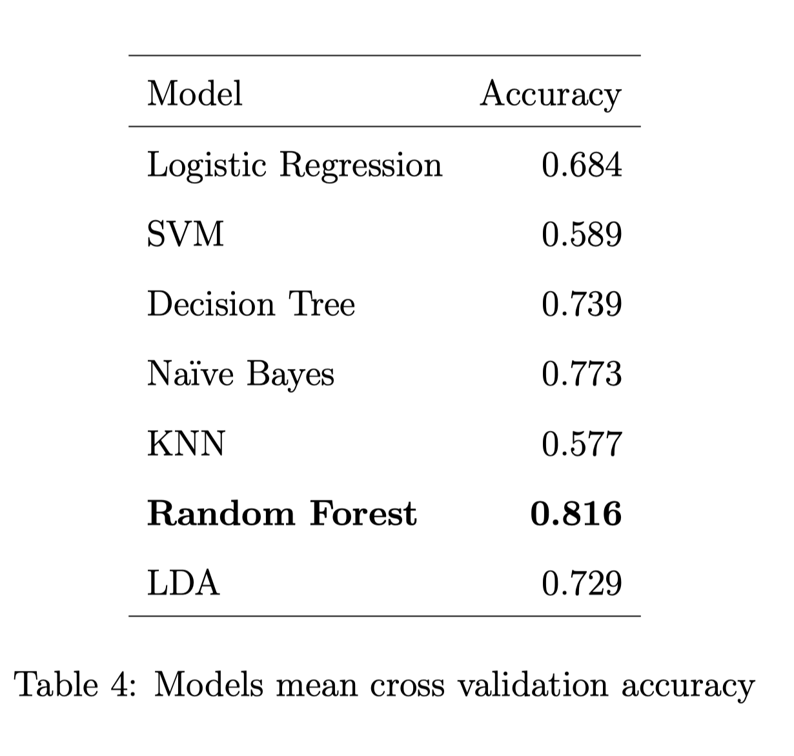
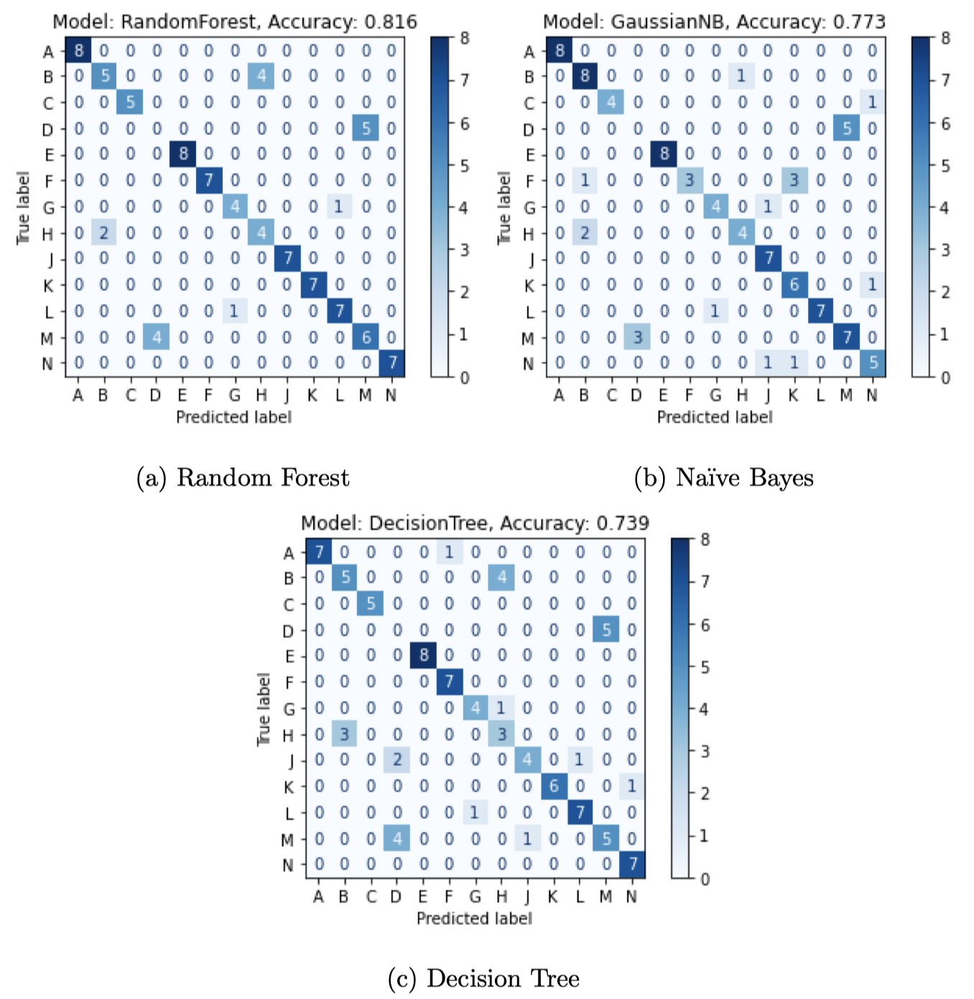
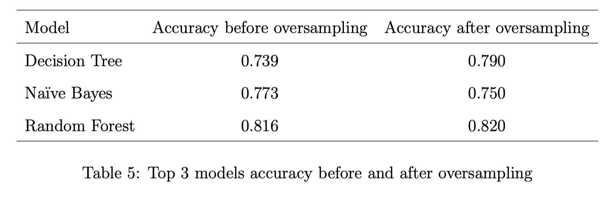
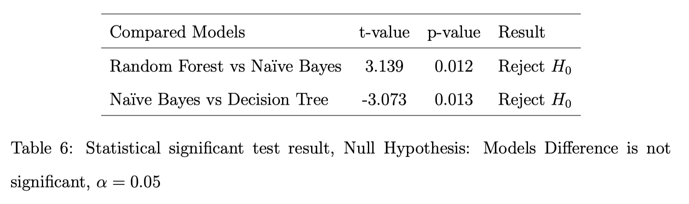
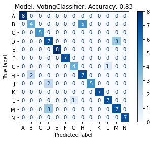

# Chemical Impurities
Predicting Impurities from Chemical Spectrum Data

## Introduction
In this challenge, a new device has been created that measures the chemical spectrum of sample chemical specimens, as well as each samples temperature. This was designed such that the devices output would be able to determine if a sample was contaminated or pure. In situations where the chemical was contaminated the device should also be able to detect what type of impurity is present. The task within this challenge is to use machine learning techniques on the devices readings to create models that can determine this impurity type.

## Performance Criteria
When determining our model’s performance on the testing set, maximising the following criterion is considered:

$\sum {I}({g_i} - \hat{g_i})$

Where ${g_i}$ is the true impurity type, and $\hat{g_i}$ is our predicted impurity type. This scoring metric can be interpreted the sum of incorrect impurity type values.

## Data
The data has eight columns, including Impurity.Percent, Impurity.Type, I, II, III, IV, V, and Temp. The I to V columns contains the readings from the five wavelength channels, and the Temp column contains the temperature of the specimen. The test set only contains the I to V wavelength channel readings and the specimen temperature, as the target variables to predict are not provided.

## Exploratory Data Analysis (EDA)
A count plot is used to compare the number of data for each impurity type label. 
||
|:--:|
| *Sample No. per Impurity Type* |

This helps us understand if the data is balanced or imbalanced. It can be seen that the number of data for each impurity type is not equal, and some impurity types have very few data points compared to others.

In following figure, it can be checked the value range and outliers of each feature. This helps us understand the distribution of the data and identify any outliers that may affect the model's performance. Some features can be seen that have outliers, but they are not significant enough to be removed.
||
|:--:|
| *Features Value Ranges* |

Using boxplots, it can also be seen if certain features can discriminate between labels. The wavelength channels can be observed, showing different distributions for different impurity types. This indicates that the wavelength channels may provide useful information for predicting impurity type.
||
|:--:|
| *Features value ranges per label* |

The density function of each feature is plotted in the next stage to see the distribution of features. This helps to understand if the data is normally distributed or skewed. We can see that most of the features are normally distributed, but some features have a heavy tail. 
||
|:--:|
| *Features Distribution* |

## Model Selection and Evaluation
The performance of seven different models on the given dataset will be compared here. The task is to predict the impurity type based on its chemical spectrum and temperature.

From the results, it can be seen that the Random Forest model has the highest accuracy of 0.816, followed by Naïve Bayes with an accuracy of 0.773. The lowest accuracy was observed for KNN with an accuracy of 0.577.

## Interpreting the results and Oversampling
In the results from the confusion matrix, we observe that our model is confusing between some classes, particularly Class D with Class M and Class H with Class B. It indicates that the model is not performing well in distinguishing between these categories. Therefore, to improve the results in these two classes, we performed oversampling.

After oversampling, the three top-performing algorithms are trained again (Random Forest, Naïve Bayes, and Decision Tree). The results of these models are compared with the results obtained before oversampling. The new results show that the models can now distinguish better between these categories.

## Statistical Significance Test
To evaluate the performance of these algorithms, a 5X2 cross-validation test is conducted[[1]](#1). 
After performing the test, the results of Random Forest, Naïve Bayes, and Decision Tree are compared to determine if the difference in accuracy between the two models is significant or due to chance.

## Final Model Selection
One popular approach in final model selection is to use ensemble methods, which combine the predictions of multiple models to make more accurate predictions. One such method is the Voting Classifier[[2]](#2) which combines the predictions of multiple classifiers using either a hard voting or soft voting strategy.

To select the final model using the Voting Classifier, it is needed to select the best-performing models from our evaluation phase. In this case, the top three models are Random Forest, Naïve Bayes, and Decision Tree. We can then use these three models as the base estimators for the Voting Classifier.

The Voting Classifier takes into account the predictions of each of the base estimators and returns the majority vote as the final prediction. By combining the strengths of each model, a more accurate and robust model can be created that can handle a variety of scenarios.

In this case, the Voting Classifier yielded an accuracy of 0.83, which is higher than any individual model's accuracy. Therefore, it is considered the final model.
||
|:--:|
| *Cross Validation Confusion Matrix for Voting Classifier* |

## References
<a id="1">[1]</a> 
Pedregosa, F. et al (2011). 
Scikit-learn: Machine Learning in Python. 
Journal of Machine Learning Research.

<a id="2">[2]</a> 
Sebastian Raschka (2018). 
MLxtend: Providing machine learning and data science 
                  utilities and extensions to Python’s  
                  scientific computing stack. 
The Journal of Open Source Software.
